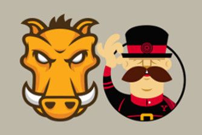

<!-- .slide: data-background="reveal.js/img/bg-4.png" -->
# Desarrollando Patrones y Herramientas

---

## Nuevos patrones y herramientas

*Mejorando el flujo de trabajo*

---

## Patrones

<ol>
	<li class="fragment">Guarda tu código fuera de la carpeta de WAB</li>
	<li class="fragment">No realices widgets de WAB desde cero</li>
	<li class="fragment">Los widgets de WAB envuelven tus propios widgets</li>
	<li class="fragment">Testea tu código fuera de WAB</li>

</ol>

---

#### Herramientas: [Yeoman](http://yeoman.io/) - [Grunt](http://gruntjs.com/)

[Esquema de flujo de trabajo con Yeoman y Grunt](https://slides.com/carlosherrera4/deck-2/live#/)
