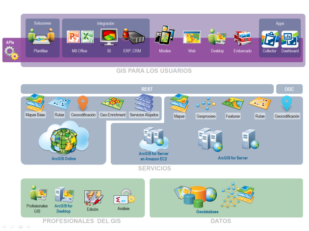

<!-- .slide: class="title" -->
## Exprimiendo la plataforma ArcGIS

[Raúl Jiménez](http://geodevelopers.org/members/139909072) - Head of developers and startups program

[bit.ly/devsummit2](http://bit.ly/devsummit2)

---

<!-- .slide: class="background" -->

## Algunas preguntas...

* ¿Cómo podría enviar un email cuando se modificase un servicio?
* ¿Qué son exáctamente los items?
* ¿Qué ventajas ofrece usar los webmaps?
* ¿Con qué lenguajes puedo crear aplicaciones?
* Se me cierra continuamente la sesión de ArcGIS Online, ¿qué pasa?
* ¿Cómo funcionan los vector tiles?
* ¿Puedo crear y subir mis propias apps configurables?, ¿dónde se alojan?
* ¿Puedo automatizar tareas con servicios alojados en ArcGIS Online?
* ¿Puedo tener algo parecido a [Google Static Maps API](https://developers.google.com/maps/documentation/static-maps/)?
* Etc.

---

<!-- .slide: class="background" -->

## En esta sesión

* Objetivo:
  * Que vosotros mismos seáis capaces de responder a 
    estas preguntas
  * Enseñaros herramientas nuevas para vuestro día a día
  * Daros ideas y romper posibles limitaciones

* Cómo:
  * Explicando la arquitectura de ArcGIS Online
  * Aprendiendo a debuguear con un caso práctico

---

<!-- .slide: class="white-background" -->

### Plataforma ArcGIS
 

  
 

---

<!-- .slide: class="white-background" -->
 

  
 

---

<!-- .slide: class="background" -->

## Ahora veremos...

Qué|Usando|Inspeccionando
---|---|---
Cómo se crea un servicio|[developers.arcgis.com](http://developers.arcgis.com)|[Chrome DevTools](https://developer.chrome.com/devtools)
Cómo se crea un webmap|[Webmap editor](http://www.arcgis.com/home/webmap/viewer.html)|[Chrome DevTools](https://developer.chrome.com/devtools)
Consumir el webmap|[Ejemplos API JS](http://esri-es.github.io/JavascriptAPI/#/7)| [JSONLint.com](http://jsonlint.com/)
Añadir item tipo documento|[Mi contenido](http://www.arcgis.com/home/content.html)|[Chrome DevTools](https://developer.chrome.com/devtools)

<!-- 1. Añadir qué peticiones buscar al guión , campos, etc-->
<!-- 2. meter marcadores-->
<!-- 3. Que permita visualizar los comentarios de la app-->

---

<!-- .slide: class="background" -->

## Poner en producción

Qué|Usando|Inspeccionando
---|---|---
Añadir un comentario|[Postman Collection](https://github.com/esri-es/ArcGIS-REST-API)|[Postman](https://chrome.google.com/webstore/detail/postman/fhbjgbiflinjbdggehcddcbncdddomop/related?hl=en)
Inspeccionar item del webmap|[/home/item.html?id=](http://www.arcgis.com/home/item.html?id=)|[Ago-asistant](https://ago-assistant.esri.com/)
Añadir vector tile personalizado|[Vector tile editor](http://esri.github.io/arcgis-vectortile-style-editor/)  [Vector Basemap Editor](http://maps.esri.com/AGSJS_Demos/templates/VectorBasemapStyleEditor/)|[Ago-asistant](https://ago-assistant.esri.com/)
Actualizar JSON de un item|[Ago-asistant](https://ago-assistant.esri.com/)|[Ago-asistant](https://ago-assistant.esri.com/)

---

<!-- .slide: class="section" -->

## ¿Qué podría hacerse con más tiempo?

---

<!-- .slide: class="background" -->

## Los límites los pone tu imaginación

* Crear bibliotecas: Node ([ArcNode](https://github.com/esri-es/ArcNode)), PHP, ...
* Extender funcionalidad:
  * Sistemas de notificaciones: [ArcNotifier](https://github.com/esri-es/ArcNotifier)
  * StaticMap -> [Class](https://github.com/esri-es/Static-Maps-API-ArcGIS) & [Service](https://github.com/esri-es/Static-Map-Service-ArcGIS)
* Sincronizar o conectar servicios con:
  * Herramientas de terceros: [Libelium](https://www.the-iot-marketplace.com/libelium-arcgis-development-kit), [Fiware](https://github.com/esri-es/Fiware-ArcGIS),  
  Google Drive/Dropbox, ...
  * BBDDs locales
* Extender el modelo de usuarios o híbridos
* Automatizar tareas de backup
* Integrar contenidos de una organización en 
  los sistemas de un cliente.
* Consumir contenidos de OpenData es apps propias

---

<!-- .slide: class="background" -->

## Recursos
* MOOC: Plataforma ArcGIS para desarrolladores web
* Herramientas para organizaciones:
  * [Ago-Assistant](https://github.com/Esri/ago-assistant)
  * [ItemInfo](https://github.com/esri-es/ItemInfo/)
* Vector tiles:
  * [Vexiza Basemap](http://vexiza.com/?page_id=6337) - ([item](http://www.arcgis.com/home/item.html?id=23176f1f55344f0db3abc922d0f67821))
  * [Custom ArcGIS Vector Tiles Video](https://www.youtube.com/watch?v=hqWYtVJRqZc)
  * [Aprende a personalizar un mapa base con ArcGIS Online](https://www.youtube.com/watch?v=syzAHxSfhzc)
  * Proyecto: [Vector Basemap Style Editor](https://github.com/jgrayson-apl/VectorBasemapStyleEditor)
* Otros:
  * [Fiddler](http://www.telerik.com/fiddler)

---

<!-- .slide: class="questions centered" -->

## ¿Preguntas?

PPT: [bit.ly/devsummit2](http://bit.ly/devsummit2/) | Encuesta: [bit.ly/esrisurvey](http://bit.ly/esrisurvey)

---

<!-- .slide: class="end" -->
