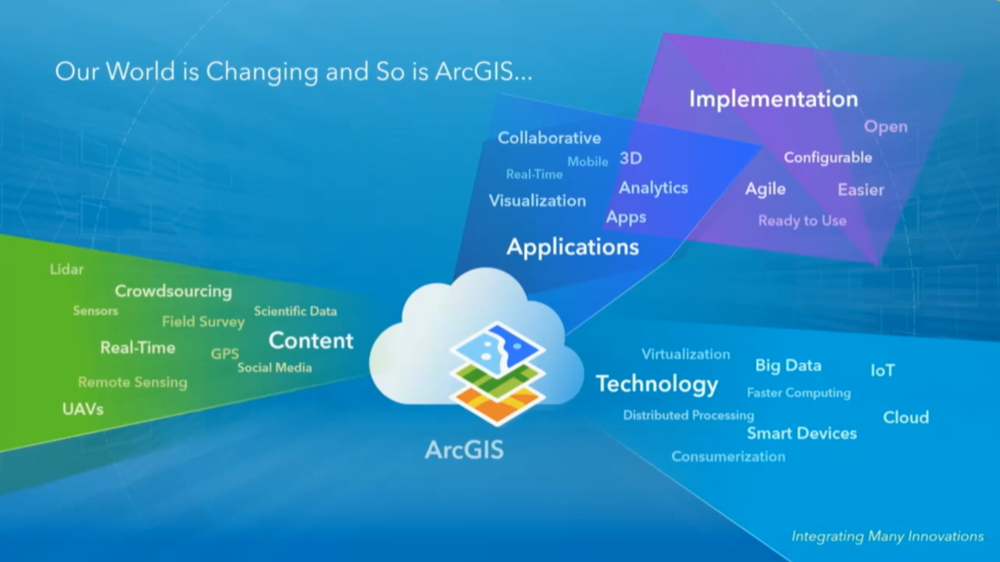
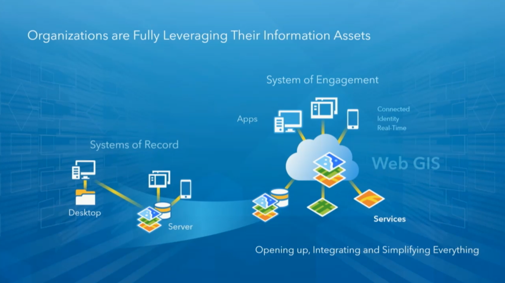
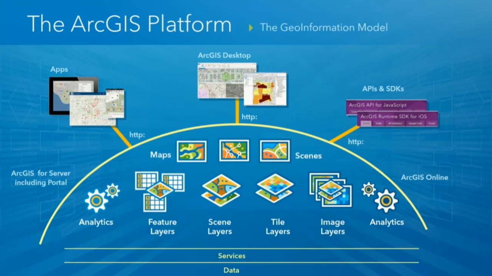

<!-- .slide: class="title" -->

## Developers: What's new?
Raúl Jiménez - Head of developers and startups program

[bit.ly/devsummit1](http://esri-es.github.io/devsummits-esri-spain/2016/sesion-inaugural/)


---

<!-- .slide: class="agenda" -->

## Intereses

* 90% ArcGIS API for Javascript
* 68% Web AppBuilder Dev Edition
* 50% Extending Desktop with Python
* 47% Configurable Apps
* 45% AppStudio
* 43% Android
* 34% ArcObjects
* 31% Extending Operations Dashboard
* 29% Extending Server SOIs/SOEs
* 25% iOS, Java
* 27% .Net
* ...


---

<!-- .slide: class="background" -->

**[Developer Summit](http://www.esri.com/events/devsummit)**, California 08-11 Marzo 16

<iframe src="https://docs.google.com/presentation/d/1D0aDPjETAdD76r8NgZe5WgmcNGxqLnYtHw1pHEiSg1E/embed?start=true&loop=false&delayms=3000" frameborder="0" width="960" height="680" allowfullscreen="true" mozallowfullscreen="true" webkitallowfullscreen="true"></iframe>


---

<!-- .slide: class="background" -->



---

<!-- .slide: class="background" -->



---

<!-- .slide: class="background" -->



---

<!-- .slide: class="background" -->


<iframe id="iframe_container" class="stretch" frameborder="0" webkitallowfullscreen="" mozallowfullscreen="" allowfullscreen=""  height="100%" width="100%"  src="https://prezi.com/embed/plj9jjmhl4bv/?bgcolor=ffffff&amp;lock_to_path=0&amp;autoplay=0&amp;autohide_ctrls=0&amp;landing_data=bHVZZmNaNDBIWnNjdEVENDRhZDFNZGNIUE43MHdLNWpsdFJLb2ZHanI0cnRuNnNrUkpkbmpiWW1xczFpWE1PSmRnPT0&amp;landing_sign=MvZ0vZ239j4GpJe1ht2D8Fy8hqm18eUHaORvUmUv_BU"></iframe>


---

<!-- .slide: class="section" -->
## Plataforma GIS

Trabajar con información espacial -> niveles de abstracción

<!--<div style="background-color:white;"> [](https://docs.google.com/drawings/d/13qEcQp7Mh2wQwJmV2EMhj3__qwf7CI26MnEbGHnejSU/pub?w=3368&h=2635)</div>-->

---

<!-- .slide: class="section" -->
## Tendencias de mercado

---

<!-- .slide: class="section" -->
## Novedades en las Runtime SDKs


---

<!-- .slide: class="section" -->

<iframe class="stretch" width="100%" height="100%" src="http://esri-es.github.io/devsummits-esri-spain/2016/sesion-inaugural/demos/1-fundamentals/multiple-views.html" frameborder="0" allowfullscreen></iframe>


---

<!-- .slide: class="section" -->
## Novedades en las Runtime SDKs

<iframe class="stretch" width="100%" height="100%" src="https://www.youtube.com/embed/1s647rCxjBk" frameborder="0" allowfullscreen></iframe>

---

<!-- .slide: class="section" -->
## Xamarin

<iframe width="420" height="315" src="https://www.youtube.com/embed/PxuQAlyEg1Q" frameborder="0" allowfullscreen></iframe>

---

<!-- .slide: class="section" -->

## List
* List item
	* List sub-item

---

<!-- .slide: class="section" -->

## Code
```javascript
var pi = 3.14;
var text = 'Hello world';
```

---

<!-- .slide: class="questions centered" -->

## Questions?

Contact info

---


<!-- .slide: class="end" -->
