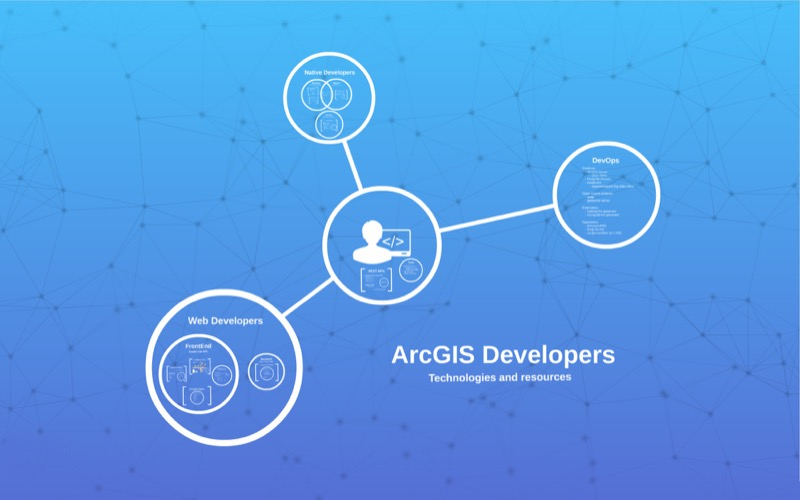
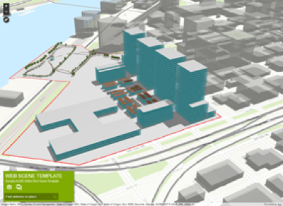
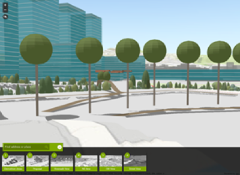
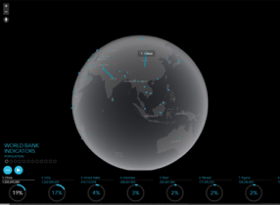
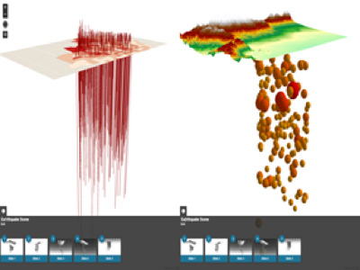
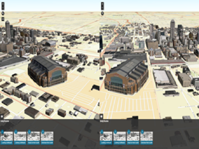
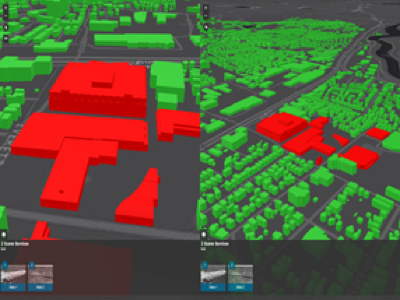
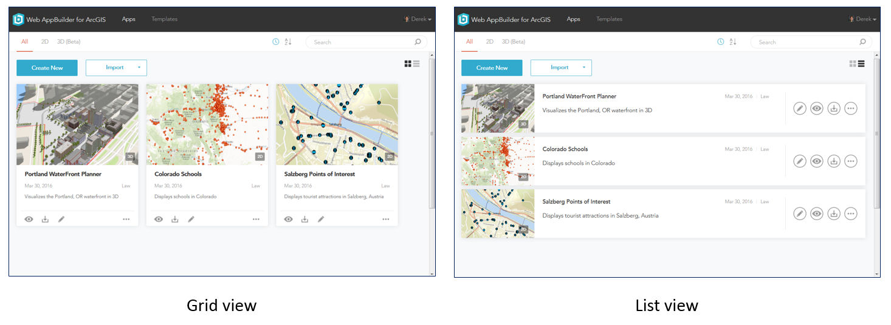

<!-- .slide: class="title" -->
## Developers: What's new?
[Raúl Jiménez](http://www.rauljimenez.info) - Head of developers and startups program

[bit.ly/devsummit1](http://esri-es.github.io/devsummits-esri-spain/2016/sesion-inaugural/)

---

<!-- .slide: class="agenda" -->

## Our goals for today

>1. Give you:
  1. An update on developers technologies
  2. Tons of resources
  3. Some tricks, good practices and tools
3. Help you better understand:
  1. How the platform works 
  2. Our developers products strategy

---

<!-- .slide: class="agenda" -->

## Your interests

* 90% ArcGIS API for Javascript
* 68% Web AppBuilder Dev Edition
* 50% Extending Desktop with Python
* 47% Configurable Apps
* 45% AppStudio
* 43% Android
* 34% ArcObjects
* 31% Extending Operations Dashboard
* 29% Extending Server SOIs/SOEs
* 25% iOS, Java
* 27% .Net
* ...

---

<!-- .slide: class="background" -->

**[Developer Summit](http://www.esri.com/events/devsummit)**, California 08-11 March '16

<iframe src="https://docs.google.com/presentation/d/1D0aDPjETAdD76r8NgZe5WgmcNGxqLnYtHw1pHEiSg1E/embed?start=true&loop=true&delayms=3000" frameborder="0" width="960" height="680" allowfullscreen="true" mozallowfullscreen="true" webkitallowfullscreen="true"></iframe>

---

<!-- .slide: class="agenda" -->

## Content for this session

* Esri's vision for developers
* Product development strategy
* Demos showing what's new in:
  * API for JavaScript 4.0
  * Runtime SDKs
* What's new in:
  * Web AppBuilder Developer Edition
  * AppStudio & Survey123
  * Web Configurable Apps

---

<!-- .slide: class="world-is-changing" -->

<!--

-->

---

<!-- .slide: class="registry-to-engagement" -->

---

<!-- .slide: class="geoinformation-model" -->

---

<!-- .slide: class="section" -->

### Developers: Technologies & Resources

<!--<iframe id="iframe_container" class="stretch" frameborder="0" webkitallowfullscreen="" mozallowfullscreen="" allowfullscreen=""  height="100%" width="100%"  src="https://prezi.com/embed/plj9jjmhl4bv/?bgcolor=ffffff&amp;lock_to_path=0&amp;autoplay=0&amp;autohide_ctrls=0&amp;landing_data=bHVZZmNaNDBIWnNjdEVENDRhZDFNZGNIUE43MHdLNWpsdFJLb2ZHanI0cnRuNnNrUkpkbmpiWW1xczFpWE1PSmRnPT0&amp;landing_sign=MvZ0vZ239j4GpJe1ht2D8Fy8hqm18eUHaORvUmUv_BU"></iframe>-->

---

<!-- .slide: class="section" -->

## API for JavaScript 4.0
### The next generation

--

### Demos

* Fundamentals
  * [New patterns](demos/1-fundamentals/new-patterns.html)
  * [Multiple views](demos/1-fundamentals/multiple-views.html)

* Scenes
  * [Navigation](demos/2-sceneview/navigation.html)
  * [Scene enviroment](demos/2-sceneview/environment.html)
  * [Local scenes](demos/2-sceneview/local-mode.html)

--

### Demos

* Map layers:
  * [Group layers](demos/3-map-layers/group-layer.html)
  * [Image layers](demos/3-map-layers/image-layer.html)

* 3D Surface:
  * [Surface analysis](http://maps.esri.com/AGSJS_Demos/templates/3D/SurfaceAnalysis/index.html)

--

### Demos

* Visualization:
  * [2D Properties](demos/4-visualization/trees-2d.html)
  * [3D Properties](demos/4-visualization/trees-3d.html)
  * [3D Realistic trees](demos/4-visualization/realistic-trees-3d.html)

* Create app from WebScenes:
  * [Web Scenes](demos/5-platform/webscene.html)
  * [Webmaps](demos/5-platform/webmap.html)

--

### Demos

* Popups:
  * [Responsive popups](demos/6-ui/popup-responsive/)
  * [Custom actions](demos/7-widgets/popup/custom-actions.html)

* Widgets (redesign, use and UI containers):
  * [Comprehensive CSS classes](demos/7-widgets/all-widgets.html)
  * [Style UI to match Map](demos/8-css/)
  * [Style UI to match custom vector tiles](demos/9-css-vectortiles/) <small>*Angeles Lakers Style*</small>

--

### Demos

###Geometry Engine:

* Geometry Engine VS Geometry Service:

  * [Buffers, time saved](http://esri-es.github.io/devsummits-esri-spain/2016/sesion-inaugural/demos/geometry-engine/ge-gs/)
  
  * [Geometry relationships, requests saved](http://esri-es.github.io/devsummits-esri-spain/2016/sesion-inaugural/demos/geometry-engine/ge-demo/requests.html)

* Simplify

  * [Polygons](http://esri-es.github.io/devsummits-esri-spain/2016/sesion-inaugural/demos/geometry-engine/ge-simplify/)

* Geometry Relationships

  * [Overlay](http://esri-es.github.io/devsummits-esri-spain/2016/sesion-inaugural/demos/geometry-engine/ge-overlay/)

  * [Geomery realtionships and tools](http://esri-es.github.io/devsummits-esri-spain/2016/sesion-inaugural/demos/geometry-engine/ge-demo/)

--

### Demos

###Geometry Engine:

* Geodesic buffer VS Planar buffer:

  * [2D dynamic](http://esri-es.github.io/devsummits-esri-spain/2016/sesion-inaugural/demos/geometry-engine/ge-buffer/)

  * [2D vs 3D static](http://esri-es.github.io/devsummits-esri-spain/2016/sesion-inaugural/demos/geometry-engine/ge-geodesic-planar-buffer/map-scene.html)

  * [2D static](http://esri-es.github.io/devsummits-esri-spain/2016/sesion-inaugural/demos/geometry-engine/ge-geodesic-planar-buffer/)

* Geodesic Length VS Planar Lenght

  * [Web Mercator](http://esri-es.github.io/devsummits-esri-spain/2016/sesion-inaugural/demos/geometry-engine/ge-length/)

  * [Azimutal Projections](http://esri-es.github.io/devsummits-esri-spain/2016/sesion-inaugural/demos/geometry-engine/ge-length/azimuthal.html)

  * [Homosolite sphere](http://esri-es.github.io/devsummits-esri-spain/2016/sesion-inaugural/demos/geometry-engine/ge-length/homosoline.html)

  * [UTM32](http://esri-es.github.io/devsummits-esri-spain/2016/sesion-inaugural/demos/geometry-engine/ge-length/utm.html)

--

### Demos

###Geometry Engine:

* Building Analysis Apps: Bus & Coffe Shops

  * [How many coffe shops are on my way?](http://esri-es.github.io/devsummits-esri-spain/2016/sesion-inaugural/demos/geometry-engine/ge-viz/coffee-color.html)

  * [How many coffe shops are on my way? (Size Symbology)](http://esri-es.github.io/devsummits-esri-spain/2016/sesion-inaugural/demos/geometry-engine/ge-viz/coffee-size.html)

  * [How many busses cross my coffe shop?](http://esri-es.github.io/devsummits-esri-spain/2016/sesion-inaugural/demos/geometry-engine/ge-viz/coffee-stores.html)

--

### ViewModels

* Contains business logic
* Easiest to combine with other JS frameworks
* Source code available. Ex. [Zoom widget](https://developers.arcgis.com/javascript/latest/api-reference/esri-widgets-Zoom.html)

--

#### Demos

* [Custom components using React](demos/7-widgets/frankenwidget/)
* [Mobile friendly components with React](demos/7-widgets/framework/)

--

### Create your own custom builds

Now you can use:

* [Bower](https://developers.arcgis.com/javascript/3/jshelp/inside_bower_custom_builds.html) 
* [Content Delivery Network - CDN](https://developers.arcgis.com/javascript/3/jshelp/intro_accessapi.html#cdn) 
* [Web Optimizer](https://developers.arcgis.com/javascript/3/jshelp/inside_web_optimizer.html)

---

<!-- .slide: class="section" -->

## What's new: Runtime SDKs

--

## Plennary demos

<iframe width="640" height="480" src="https://www.youtube.com/embed/h2IeCJLfXNE" frameborder="0" allowfullscreen></iframe>

---

<!-- .slide: class="section" -->

## What's new: 
###Configurable Apps & Builders

--

### Evolution

--

### AppStudio

--

<!-- .slide: class="appstudio" -->

--

--

### AppStudio Roadmap

--

### New 3D Configurable Apps

--

#### Simple Scene Viewer

--

#### 3D Data Visualization

--

### Compare 3D Scenes

--

### Web AppBuilder Developer Edition 2.0 

--

### 3D support + new widgets 

--

### New tools & Workflows

---

<!-- .slide: class="questions centered" -->

## Questions?

Contact info

---

<!-- .slide: class="end" -->
