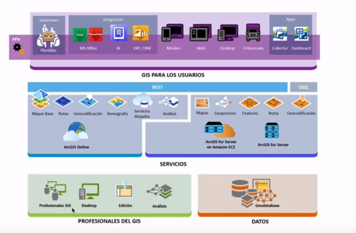
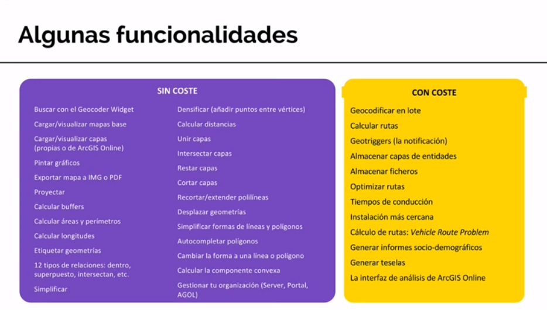
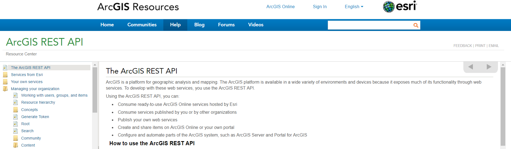
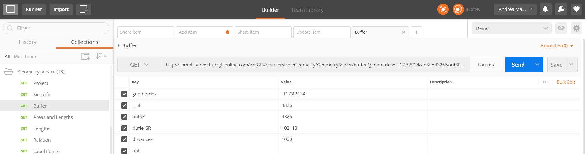
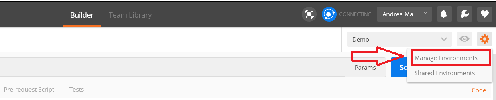
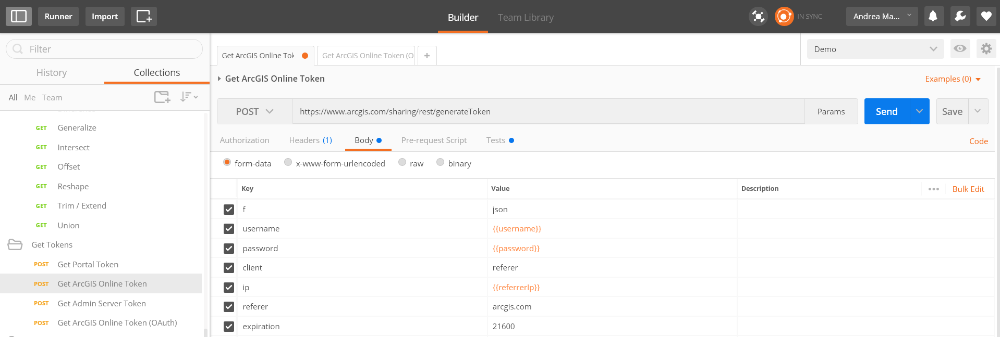
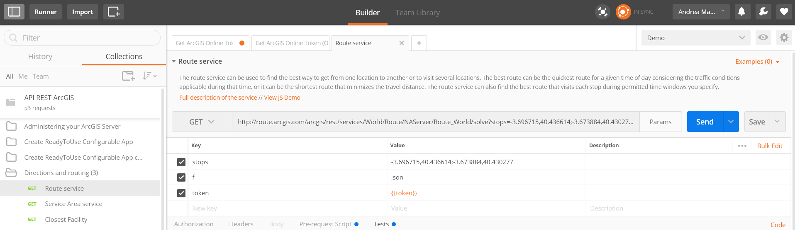

<!-- .slide: class="title" -->

## API REST de ArcGIS

--

<!-- .slide: class="section" -->

## ¿Por qué aprender a usar la API?

- Entender mejor el funcionamiento de las APIs
- Saber cómo crear tus propias librerías (Ruby, PHP, Python, etc...)
- Aprender a extender las librerías actuales (Ejemplo: Static-Maps-JS-API-ArcGIS )
- Aprender a depurar mejor tus aplicaciones

--

<!-- .slide: class="section" -->

## Plataforma ArcGIS

* [Arquitectura de ArcGIS Online](https://prezi.com/y6cisa2fbhht/arcgis-online-architecture/)

--

<!-- .slide: class="section" -->

## Plataforma ArcGIS

---

## Documentación

 

--

<!-- .slide: class="section" -->

## Utilizando la API REST de ArcGIS

- Consumir Servicios Ready-to-Use alojados en ArcGIS Online y publicados por ESRI
- Consumir servicios publicados por ti alojados en tu organización
- Publish your own web services
- Create and share items on ArcGIS Online or your own portal
- Configure and automate parts of the ArcGIS system, such as ArcGIS Server and Portal for ArcGIS

--

<!-- .slide: class="section" -->

## How to use the ArcGIS REST API

You can invoke the ArcGIS REST API through any language that can make HTTP requests. This includes Java, .NET, Python, Scala, and many others.

To successfully develop with the ArcGIS REST API, you’ll need to know:

+ Which requests to make
+ How to structure the requests correctly
+ How to anticipate and use the responses

--

<!-- .slide: class="section" -->

## A tour of the API
###  Parts of the API

**Ready-to-use ArcGIS Online services**
 - To work with ready-to-use web services that Esri produces and hosts on ArcGIS Online (geocoding services, network analysis services, basemaps...)
 - Some of these services may require a subscription to ArcGIS Online and others may be used for free
 - Each service has a concrete URL

--

<!-- .slide: class="section" -->

## A tour of the API
###  Parts of the API

**ArcGIS services**
 - Geospatial services (map services, feature services, image services, geoprocessing services, geometry services...)
 - Need to know the URL to the specific services you want to use
 - All services of a particular type (for example, all feature services) conform to the same API and have the same REST signature of resources and operations

--

<!-- .slide: class="section" -->

## A tour of the API
###  Parts of the API

**Portal services**
  - Each subscription to ArcGIS Online includes its own portal, or you may have a portal from your implementation of Portal for ArcGIS.
  - The ArcGIS REST API contains a hierarchy of resources and operations for working with GIS portals
  - You can use the API to upload items, share items, and manage users and groups

--

<!-- .slide: class="section" -->

## A tour of the API
###  Parts of the API

**Server administration**
 - Anything you can do in ArcGIS Server Manager is available through scripting using the ArcGIS REST API

**Data types**
 - Some data types are used throughout the API for referencing common GIS entities such as geometries, symbols, and web maps

---

<!-- .slide: class="section" -->

## Using Postman with API REST ArcGIS

* Postman:  [getpostman.com](https://www.getpostman.com/)

* API REST ArcGIS Collection  

* API Open Data ArcGIS Collection 

 

--

<!-- .slide: class="section" -->

## Postman Environments

---

## Ejercicios
### Ejercicio 1. Generar Token ArcGIS Online

--

<!-- .slide: class="section" -->

## Ejercicios
### Ejercicio 2. Servicio de Rutas

* En la descripción podéis encontrar una [Demo](http://developers.arcgis.com/javascript/samples/widget_directions_basic/) utilizando la API de JavaScript que utiliza esa funcionalidad de la API REST.

---

<!-- .slide: class="end" -->
