<!-- .slide: class="title" -->

## API REST de ArcGIS

--

<!-- .slide: class="section" -->

## ¿Por qué aprender a usar la API?

- Entender mejor el funcionamiento de las APIs
- Saber cómo crear tus propias librerías (Ruby, PHP, Python, etc...)
- Aprender a extender las librerías actuales (Ejemplo: Static-Maps-JS-API-ArcGIS )
- Aprender a depurar mejor tus aplicaciones

--

<!-- .slide: class="section" -->

## Plataforma ArcGIS

* [Arquitectura de ArcGIS Online](https://prezi.com/y6cisa2fbhht/arcgis-online-architecture/)

--

<!-- .slide: class="section" -->

## Plataforma ArcGIS

---

## Documentación

 

--

<!-- .slide: class="section" -->

## Utilizando la API REST de ArcGIS

- Consumir Servicios Ready-to-Use alojados en ArcGIS Online y publicados por ESRI
- Consumir servicios publicados por ti alojados en tu organización
- Publish your own web services
- Create and share items on ArcGIS Online or your own portal
- Configure and automate parts of the ArcGIS system, such as ArcGIS Server and Portal for ArcGIS

--

<!-- .slide: class="section" -->

## How to use the ArcGIS REST API

You can invoke the ArcGIS REST API through any language that can make HTTP requests. This includes Java, .NET, Python, Scala, and many others.

To successfully develop with the ArcGIS REST API, you’ll need to know:

+ Which requests to make
+ How to structure the requests correctly
+ How to anticipate and use the responses

--

<!-- .slide: class="section" -->

## A tour of the API
###  Parts of the API

**Ready-to-use ArcGIS Online services**
 - To work with ready-to-use web services that Esri produces and hosts on ArcGIS Online (geocoding services, network analysis services, basemaps...)
 - Some of these services may require a subscription to ArcGIS Online and others may be used for free
 - Each service has a concrete URL

--

<!-- .slide: class="section" -->

## A tour of the API
###  Parts of the API

**ArcGIS services**
 - Geospatial services (map services, feature services, image services, geoprocessing services, geometry services...)
 - Need to know the URL to the specific services you want to use
 - All services of a particular type (for example, all feature services) conform to the same API and have the same REST signature of resources and operations

--

<!-- .slide: class="section" -->

## A tour of the API
###  Parts of the API

**Portal services**
  - Each subscription to ArcGIS Online includes its own portal, or you may have a portal from your implementation of Portal for ArcGIS.
  - The ArcGIS REST API contains a hierarchy of resources and operations for working with GIS portals
  - You can use the API to upload items, share items, and manage users and groups

--

<!-- .slide: class="section" -->

## A tour of the API
###  Parts of the API

**Server administration**
 - Anything you can do in ArcGIS Server Manager is available through scripting using the ArcGIS REST API

**Data types**
 - Some data types are used throughout the API for referencing common GIS entities such as geometries, symbols, and web maps

---

<!-- .slide: class="section" -->

## Using Postman with API REST ArcGIS

* Postman:  [getpostman.com](https://www.getpostman.com/)

* API REST ArcGIS Collection  

* API Open Data ArcGIS Collection 

 

--

<!-- .slide: class="section" -->

## Postman Environments

---

## Ejercicios
### Ejercicio 1. Generar Token ArcGIS Online
Documentación: [Generar Token](http://resources.arcgis.com/en/help/arcgis-rest-api/index.html#//02r3000000ts000000)

--

<!-- .slide: class="section" -->

## Ejercicios
### Ejercicio 1. Generar Token ArcGIS Online

**Para que se nos guarde el id token como variable**

* Accedemos al Test y creamos la variable de entorno llamada "token" guardando el id del token obtenido en la petición anteriormente realizada.

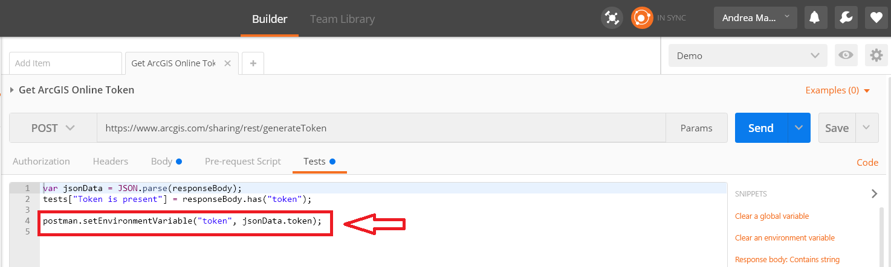

--

<!-- .slide: class="section" -->

## Ejercicios
### Ejercicio 1. Generar Token ArcGIS Online

* Además le establecemos que nos devuelva el mensaje "Token is present" en caso de que identifique que la respuesta obtenida contiene el token

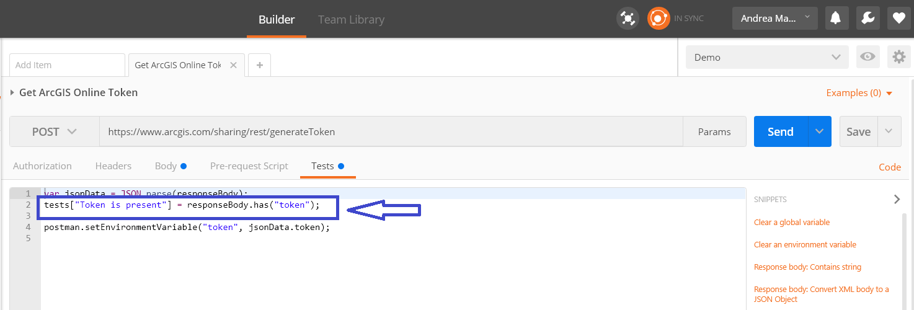

--

<!-- .slide: class="section" -->

## Ejercicios
### Ejercicio 1. Generar Token ArcGIS Online

* Obtenemos el id del token que observamos en el Body.

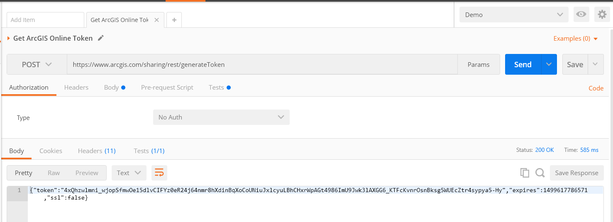

--

<!-- .slide: class="section" -->

## Ejercicios
### Ejercicio 1. Generar Token ArcGIS Online

* Comprobamos que efectivamente nos ha guardado el id del token en el entorno "Demo"

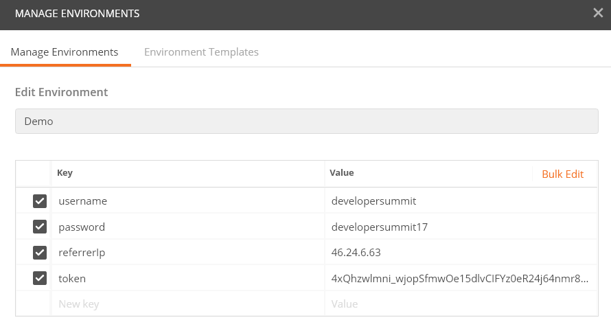

--

<!-- .slide: class="section" -->

## Ejercicios
### Ejercicio 2. Generar Token con Oauth

--

<!-- .slide: class="section" -->

## Ejercicios
### Ejercicio 3. Servicio de Rutas

* En la descripción podéis encontrar una [Demo](http://developers.arcgis.com/javascript/samples/widget_directions_basic/) utilizando la API de JavaScript que utiliza esa funcionalidad de la API REST.

--

<!-- .slide: class="section" -->

## Ejercicios
### Ejercicio 4. Crear un nuevo ítem en ArcGIS Online

* Accedemos a Create ReadyToUse Configurable App/Add Item

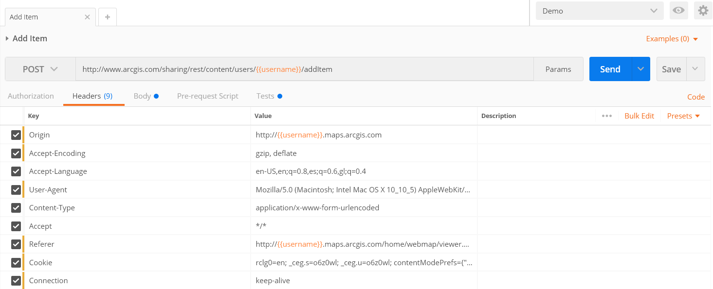

--

<!-- .slide: class="section" -->

## Ejercicios
### Ejercicio 4. Crear un nuevo ítem en ArcGIS Online

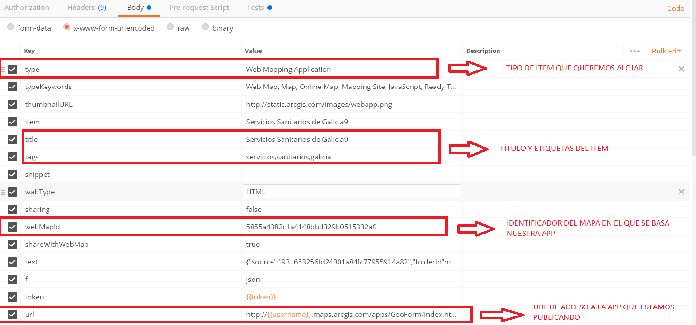

--

<!-- .slide: class="section" -->

## Ejercicios
### Ejercicio 4. Crear un nuevo ítem en ArcGIS Online

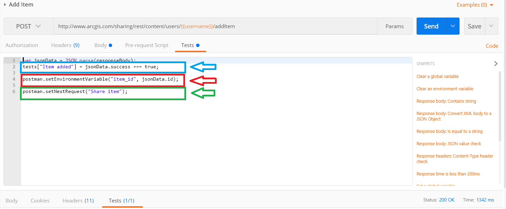

--

<!-- .slide: class="section" -->

## Ejercicios
### Ejercicio 4. Crear un nuevo ítem en ArcGIS Online

* Resultado obtenido

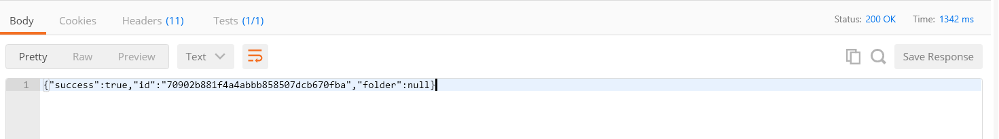

--

<!-- .slide: class="section" -->

## Ejercicios
### Ejercicio 4. Crear un nuevo ítem en ArcGIS Online

* Comprobamos que el Ítem se ha creado correctamente dentro de nuestra organización de ArcGIS Online.

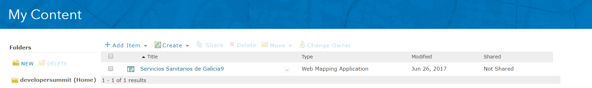

--

<!-- .slide: class="section" -->

## Ejercicios
### Ejercicio 8. Crear un nuevo servicio

* Accedemos a Host Services (+4) / Create Feature Service
* Observamos los parámetros necesarios que necesita la petición

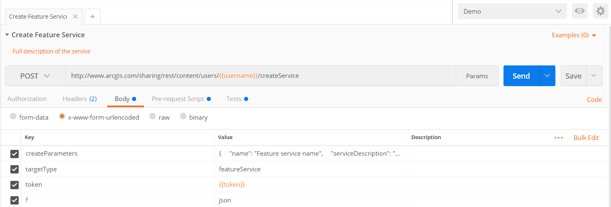

--

<!-- .slide: class="section" -->

## Ejercicios
### Ejercicio 8. Crear un nuevo servicio

* Creamos la variable de entorno “feature_service_name” en el ventana “Tests”, la cual recogerá el nombre del Feature Service que hemos creado

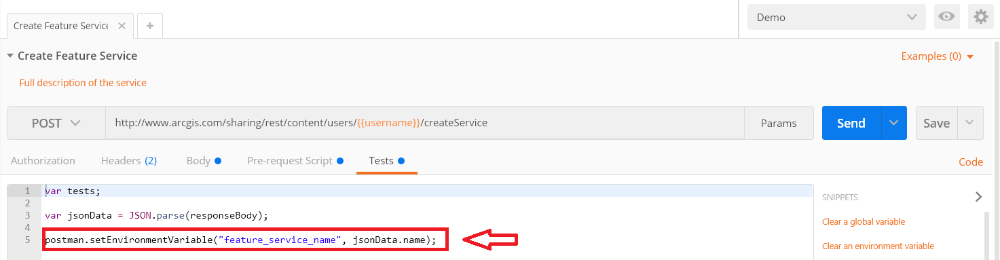

--

<!-- .slide: class="section" -->

## Ejercicios
### Ejercicio 8. Crear un nuevo servicio

* Enviamos la petición y obtenemos la información en formato json del feature service que hemos creado.

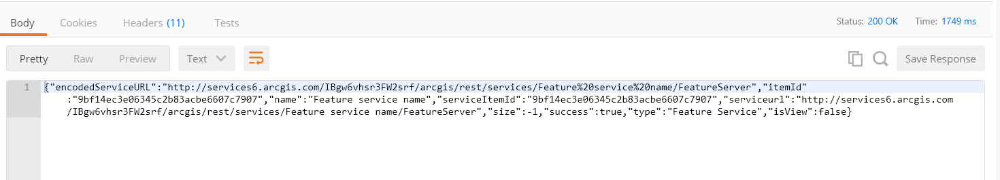

--

<!-- .slide: class="section" -->

## Ejercicios
### Ejercicio 8. Crear un nuevo servicio

* Comprobamos que el Feature Service se ha creado correctamente dentro de nuestra organización de ArcGIS Online.

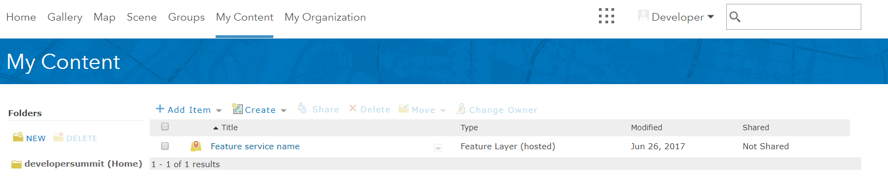

--

<!-- .slide: class="section" -->

## Ejercicios
### Ejercicio 8.1. Comprobar que existe un Feature Service concreto
* Accedemos a Managing your organization/Get private info
* Para poder crear una servicio se requiere el identificador de tu cuenta como parámetro. Para poder obtenerlo ejecutamos como primer paso del ejercicio la petición “Get private user info”.

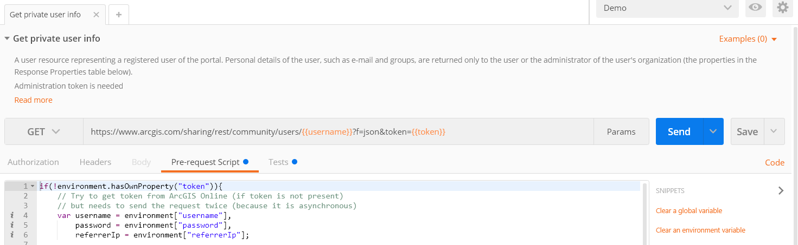

--

<!-- .slide: class="section" -->

## Ejercicios
### Ejercicio 8.1. Otra forma de Comprobar que el Feature Service se ha creado correctamente utilizando la API REST

* Accedemos a Host Services (+4)/Check if feature service exist.

--

<!-- .slide: class="section" -->

## Ejercicios
### Ejercicio 8.1. Otra forma de Comprobar que el Feature Service se ha creado correctamente utilizando la API REST

* Enviamos la petición y obtenemos la información de si existe o no el Feature Service.

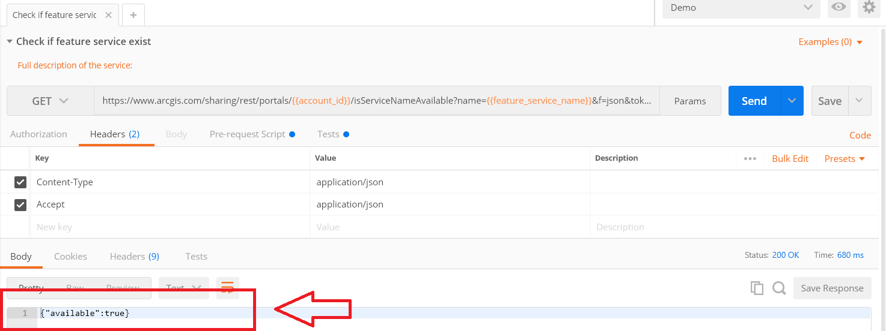

---

<!-- .slide: class="end" -->
