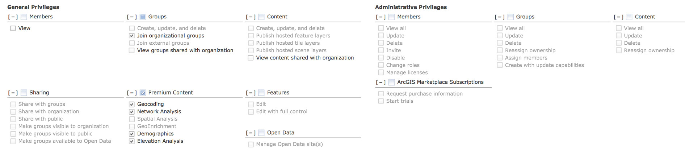
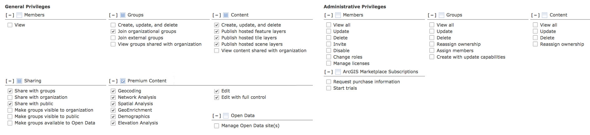

<!-- .slide: class="title" -->

## Arquitecturas híbridas

Raúl Jiménez Ortega ([@hhkaos](//twitter.com/hhkaos))

[bit.ly/DevSummit17-4](http://bit.ly/DevSummit17-4)

---

<!-- .slide: class="agenda" -->

### Agenda

* Desmontando un mito
* Tipos de cuentas
* Qué se puede y qué no
* oAuth & refresh_token
* Caso práctico

---

<!-- .slide: class="section" -->

### Desmontando un mito

> Si se vas desarrollar una app usando ArcGIS y va a tener 1000, un millón, o los usuarios
registrados que sea... `no implica necesariamente que haya que comprar ese número de usuarios nominales`.

--

<!-- .slide: class="white" -->

---

<!-- .slide: class="section" -->

### Tipos de cuentas

|Tipo|Coste|Propósito|Ámbito|
|---|---|---|---|
|[Cuenta pública](https://www.arcgis.com/home/createaccount.html)|No|Personal|Cloud|
|[Usuario de organización - Nivel 1](http://www.esri.com/arcgis/trial)|Sí|Profesional|Cloud & On-premise|
|[Usuario de organización - Nivel 2](http://www.esri.com/arcgis/trial)|Sí|Profesional|Cloud & On-premise|
|[Cuenta de desarrollador](https://developers.arcgis.com/sign-up)|No|Dev & Test|Cloud|

--

### Cuenta pública

|Puede|No puede|
|---|---|
|Crear Web Maps, Web Scenes, alojar ficheros estáticos (CSV, KML,...) y crear notas de mapa|Hacer análisis, crear servicios
|Crear storymaps y apps configurables|Usar apps configurables personalizadas ni Web AppBuilder
|Crear grupos|Unirse a grupos creados por organizaciones
|Cargar sus contenidos y los de 3os en un mapa|Configurar geocodificador, etc.

Considerar para modelos B2C ¿y B2G que incluyen al ciudadano? <- REST API

--

### Usuario de organización - Nivel 1

El administrador define los roles y sus privilegios + Apps

--

### Usuario de organización - Nivel 2

El administrador define los roles y sus privilegios + Apps

--

### Cuenta de desarrollador

> La cuenta de desarrollador `es una cuenta de organización mono-usuario de nivel 2`
que se puede usar para desarrollar aplicaciones y testearlas, pero no para sacar una aplicación
a producción <- salvo si no tiene ánimo de lucro.

---

<!-- .slide: class="section" -->

### Qué se puede y qué no

--

### Se puede

* Usar cuentas públicas y de organización en una misma app
* Seguir un enfoque híbrido (usuarios ArcGIS y propios)
* Usar la conexión con ArcGIS para ampliar funcionalidad ([Ipsilum](https://docs.google.com/presentation/d/1-jg8KKDmBRqk7ziVRIxZ68O-Z7DS-cXsEENt5Qw85O8/edit?usp=sharing))
* Usar un proxy + oAuth (o credenciales) para crear una app que usuarios 
sin cuenta de ArcGIS puedan:
  * Visualizar contenidos Premium 
  * Consumir servicios de ArcGIS Online con coste en créditos
  * Limitar el acesso público de un servicio a una serie de dominios

--

### No se puede (por TOS)

* Crear un sistema propio de control de acceso a los  
  datos geográficos que permita `utilizar/compartir un`  
  `solo usuario nominal entre varios usuarios`.

* `Embeber credenciales de un usuario nominal` 
  `en una app o proxy` para darle privilegios a varios usuarios 
  ("puentear" los usuarios nominales) para por ejemplo: crear 
  servicios o items, permitir el acceso a datos privados a ciertos 
  usuarios, compartir items con grupos, etc.

--

### En definitiva

Necesitaremos un usuario de organización (de pago) cuando necesitemos:
* Limitar (por usuario) el acceso a información no pública (alojada en ArcGIS).
* Que el usuario pueda formar parte de grupos (de ArcGIS)
* Que pueda hacer uso de las apps (Collector, Web AppBuilder, etc)
* O queramos que este pueda crear servicios de: entidades, imágenes, etc.

> Si el usuario no requiere de ninguna de estas funcionalidades podremos Usar
cuentas públicas de ArcGIS o un sistema de usuarios propio

---

<!-- .slide: class="section" -->

### oAuth y refresh_token

\- diagrama -

--

---

<!-- .slide: class="section" -->

### Casos práctico

\- una app con modelo híbrido -

--

<!-- .slide: class="section" -->

## Caso: Portal Inmobiliario (B2C)

> * **Empleados**: gestionan los apartamentos, pedidos, etc.
* **Clientes**:
  * Inquilinos y compradores: buscan pisos,
hacen análisis espacial (ArcGIS Online), guardan favoritos, preferencias de búsqueda, etc.
  * Propietarios: publican y gestionan sus viviendas, cambian la visibilidad de sus pisos, etc.

--

### Empleados

* **Usuarios org. (L2)**: Crear y gestionan la BD de pisos,  
  y demás info geolocalizada (por ej: dpto. operaciones)

* **Usuarios org. (L1)**: Si necesitan acceso sólo lectura  
  a info privada (como pisos que estén alquilados) 
  (por ej: dpto. financiero)

* **Usuarios propios**: No trabajan con info geogr. privada 
  pero pueden requerir de hacer análisis espacial, acceder 
  a contenido premium o crear storymaps (por ej: dpto.  
  marketing)

--

### Clientes

* **Usuarios org. (L2)**: Si los propietarios 
  de pisos puedan publicar directamente sus pisos en 
  ArcGIS y acceder a información geolocalizada restringida.

* **Usuarios propios**: buscar y guardan 
  pisos como favoritos, comentan los pisos, etc.

* **Cuentas públicas**: si queremos que puedan crear  
  web maps, storymaps, etc.

* **Proxy**: si queremos que puedan hacer análisis  
  usando servicios de ArcGIS Online.

---

<!-- .slide: class="section centered" -->

## ¿Preguntas?

* Raúl Jiménez Ortega: raul.jimenez@esri.es

Feeback: [bit.ly/DevSummit17-FB](http://bit.ly/DevSummit17-FB)

Transparencias: [bit.ly/DevSummit17-4](http://bit.ly/DevSummit17-4)

---

<!-- .slide: class="end" -->
#
