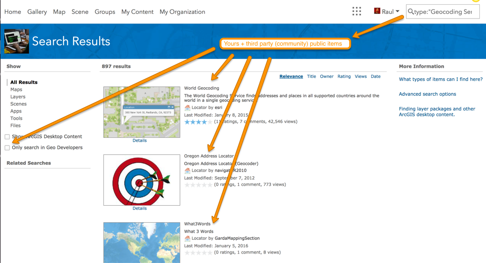
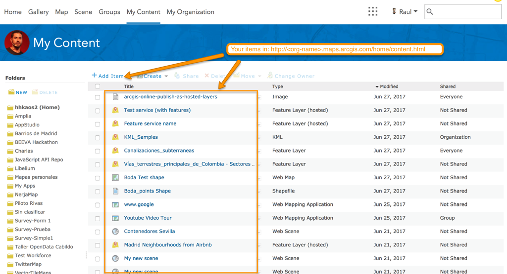
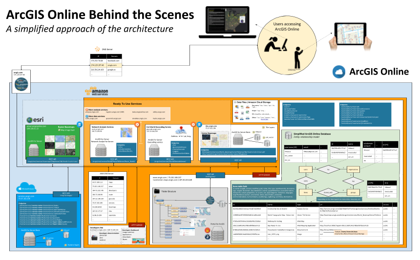
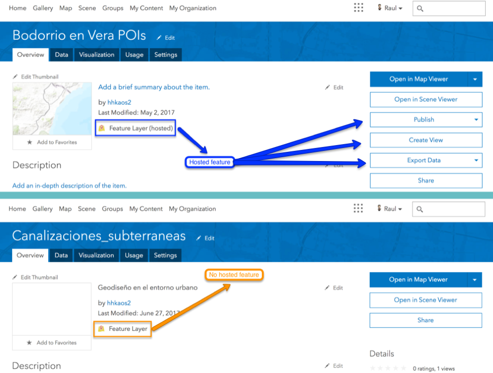
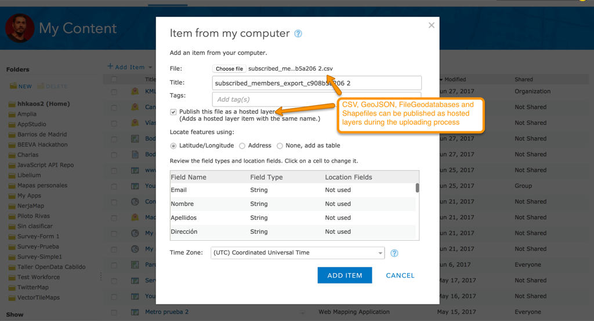
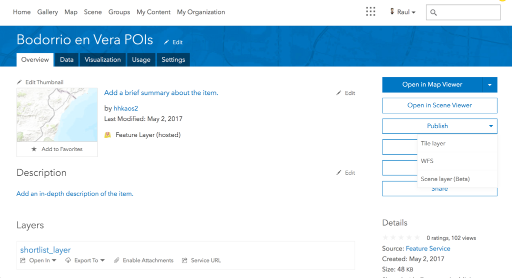

<!-- .slide: class="title" -->

## GeoInformation model

Raúl Jiménez Ortega ([@hhkaos](//twitter.com/hhkaos))

[bit.ly/DevSummit17-5](http://bit.ly/DevSummit17-5)

---

<!-- .slide: class="agenda" -->

### Agenda

* Items
* Contenido en ArcGIS Online
* Transformar capas alojadas

---

<!-- .slide: class="section" -->

### Items

[](imgs/lord-of-the-rings.gif)

> "*One item to rule them all*" - Frodo Bolson

--

#### Items públicos

[](imgs/arcgis-online-public-items.png)

--

#### Tus items

[](imgs/organization-items.png)

--

#### DevSummit 2016 - Infraestructura de ArcGIS Online



Contenido: [Vídeo](https://youtu.be/OhYGSt2C9ys?t=3m28s) | [Prezi](https://prezi.com/y6cisa2fbhht/arcgis-online-architecture/)

--

#### Item como objeto "polimórfico"

```
{
  id: "cdee8b2c89bd4645bd0ec4be8de6a5ca",
  owner: "hhkaos2",
  orgId: "Q6ZFRRvMTlsTTFuP",
  created: 1498561250000,
  title: "Canalizaciones_subterraneas",
  type: "Feature Service",
  typeKeywords: ["ArcGIS Server", "Data", "Feature Access", "Feature Service", "Multilayer", "Service"],
  description: ...,
  tags: ...,
  thumbnail: ...,
  url: "http://demos.esri.es/arcgis/rest/services/Hosted/Canalizaciones_subterraneas/FeatureServer",
  access: "public",
  numComments: 0,
  numRatings: 0,
  avgRating: 0,
  numViews: 4,
  ...
}
```
Búsqueda avanzada -> [type:"Geocoding Service"](http://www.arcgis.com/home/search.html?q=type%3A%22Geocoding%20Service%22&t=content) | [typekeywords:VR360](http://www.arcgis.com/home/search.html?q=typekeywords%3AVR360&t=content)

--

## Ejemplos

`arcgis.com/sharing/rest/content/items/<itemId>`

|Tipo item|Metadatos|Datos (`/data`)|
|---|---|---|
|Hosted Feature Service|[Metadatos](http://www.arcgis.com/sharing/rest/content/items/ce8f27e50cd14edeb85255140a1b4efa?f=json)|---
|Feature Service|[Metadatos](http://www.arcgis.com/sharing/rest/content/items/cdee8b2c89bd4645bd0ec4be8de6a5ca?f=json)| ---
|Document link|[Metadatos](http://www.arcgis.com/sharing/rest/content/items/b7084a6fc08149428c193567d1f205c5?f=json)|---
|Web Map|[Metadatos](http://www.arcgis.com/sharing/rest/content/items/d8855ee4d3d74413babfb0f41203b168?f=json)|[Datos](http://www.arcgis.com/sharing/rest/content/items/d8855ee4d3d74413babfb0f41203b168/data?f=json)
|App configurable|[Metadatos](http://www.arcgis.com/sharing/rest/content/items/b17113eb9535427db477777f86f25d63?f=json)|[Datos](http://www.arcgis.com/sharing/rest/content/items/b17113eb9535427db477777f86f25d63/data?f=json)
|Fichero estático (PNG)|[Metadatos](http://www.arcgis.com/sharing/rest/content/items/9bfee5fcac174d4d9e6881f1586493ee?f=json)|[Datos](http://www.arcgis.com/sharing/rest/content/items/9bfee5fcac174d4d9e6881f1586493ee/data?f=json)

--

## Más info:

* [ArcGIS REST API](https://esri-es.github.io/awesome-arcgis/arcgis/products/arcgis-online/rest-apis/)
  
  * [Items & items types](http://resources.arcgis.com/en/help/arcgis-rest-api/index.html#/Items_and_item_types/02r3000000ms000000/) 

  * [Item params](http://resources.arcgis.com/en/help/arcgis-rest-api/index.html#/Item/02r30000007w000000/)

---

<!-- .slide: class="section" -->

### Contenido en ArcGIS Online

--

#### Analogía de ArcGIS Online

> ArcGIS Online equivaldría a una Federación de ArcGIS Enterprises ("Basic"). Uno por cada cuenta de organización o Developer Suscription.

--

#### ArcGIS Enterprise ¿"Basic"?

Este nivel **no existe**, pero sería algo como:

* ArcGIS Server (Basic) + Editar entidades
* Portal for ArcGIS 
* ArcGIS Data Store <- Consume créditos
* ArcGIS Web Adaptor

--

#### Como ficheros estáticos

* Ficheros de hasta (1GB <- $0.12/mes):
  * Espaciales: GeoJSON, KML, Shape
  * Tabulares: CSV, XLS, ...
  * Comprimidos: ZIP
  * Imágenes: JPG, PNG, TIFF, ...
  * Documentos: DOC, PDF, PPT, ...
  * [ver los >80 formatos](http://doc.arcgis.com/es/arcgis-online/reference/supported-items.htm)

> **Nota**: Estos ficheros se alojan en Amazon S3 ([item](http://www.arcgis.com/sharing/rest/content/items/9bfee5fcac174d4d9e6881f1586493ee?f=json))

--

#### Capas alojadas vs no alojadas



--

#### Como servicio se pueden alojar:

* Feature layers ([item](http://www.arcgis.com/sharing/rest/content/items/ce8f27e50cd14edeb85255140a1b4efa?f=json))
* Feature layer views
* Tile layers ([item](http://www.arcgis.com/sharing/rest/content/items/0a3c763bcb254c4fa4549b45814be5cd?f=json))
* Scene layers ([item](http://www.arcgis.com/sharing/rest/content/items/6db845826cec4ebc8d6306b5c0061f7a?f=json))
* Vector tiles layers ([item](http://www.arcgis.com/sharing/rest/content/items/af6063d6906c4eb589dfe03819610660?f=json))
* WFS layers ([item](http://www.arcgis.com/sharing/rest/content/items/b6ca65b6a7c24613b4c4c9a229cb7e4c?f=json))
* WMTS layers ([item](http://www.arcgis.com/sharing/rest/content/items/ab3a42783f2848199b74967a64bfc389?f=json))
* Elevation layers ([item](http://www.arcgis.com/sharing/rest/content/items/1b243539f4514b6ba35e7d995890db1d?f=json))

\- [Más info](http://doc.arcgis.com/en/arcgis-online/share-maps/hosted-web-layers.htm#ESRI_SECTION1_5E584527C2BE44BB848B875F47B0434A) -

--

#### Transformar estáticos en servicios alojados



Puedes convertír los CSV, GeoJSON, Shapefiles, File Geodatabase


---

<!-- .slide: class="section" -->

### Transformar capas alojadas 1/2

* Los servicios de entidades alojados se <br>
  pueden publicar como:

  * Tile Layers
  * WFS
  * Scene layers (beta)

* Independientemente de que tengan<br>
  una o múltiples capas

--

####  Transformar capas alojadas 2/2



**Nota**: salvo las "Scene layers" que requiere exclusivamente que el <br>
servicio contenga capas de puntos, el resto pueden ser combinadas.

---

<!-- .slide: class="section centered" -->

## ¿Preguntas?

Raúl Jiménez Ortega: raul.jimenez@esri.es

Feeback: [bit.ly/DevSummit17-FB](http://bit.ly/DevSummit17-FB)

Transparencias: [bit.ly/DevSummit17-5](http://bit.ly/DevSummit17-5)

---

<!-- .slide: class="end" -->
#
