<!-- .slide: class="title" -->

## Iniciativas para desarrolladores
Raúl Jiménez Ortega ([@hhkaos](//twitter.com/hhkaos))

[bit.ly/DevSummit17-1](http://bit.ly/DevSummit17-1)

---

<!-- .slide: class="agenda" -->

### Agenda

* Recursos de apoyo (5)
* Novedades (4)
* Comunidad (3)

---

<!-- .slide: class="section" -->

### Recursos de apoyo

\- 5 iniciativas -

--

### [GeoDevelopers.org](http://www.geodevelopers.org/academy) (Webinars)

[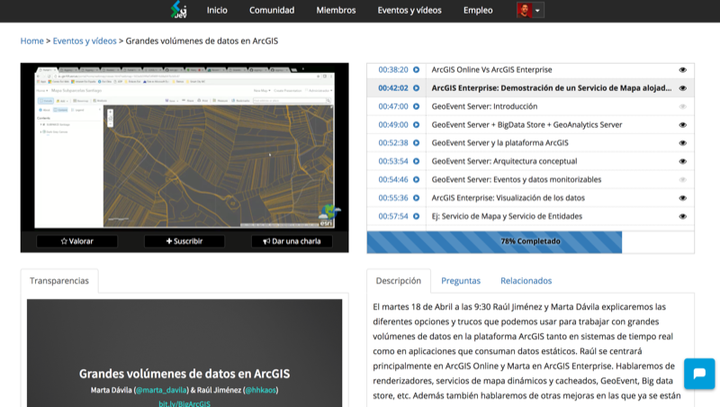](http://www.geodevelopers.org/academy)

168 vídeos ~150h ~19 jornadas

--

### [Awesome ArcGIS](https://esri-es.github.io/awesome-arcgis/) (Wiki)

[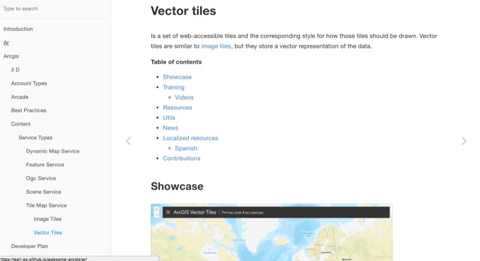](https://esri-es.github.io/awesome-arcgis/)

\> 126 páginas, > 500 recursos

--

### [Github Esri España](github.com/esri-es) (Code samples & PPTs)

[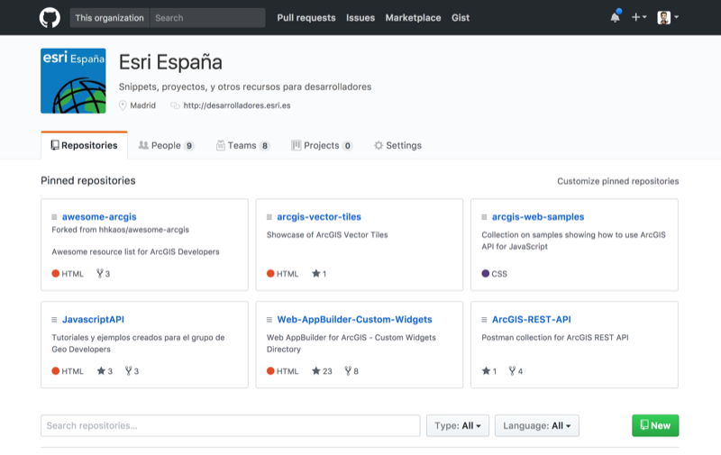](http://desarrolladores.esri.es/upcoming/moocs/plataforma-arcgis/)

\> 60 repositorios

--

### [ArcGIS DevLabs](http://desarrolladores.esri.es/upcoming/labs/) (Tutoriales texto)

[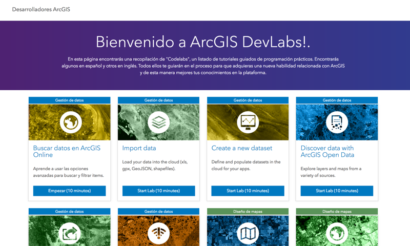](http://desarrolladores.esri.es/upcoming/labs/)

17 + 3 tutoriales de entre [5-20]min ~3h

--

### [MOOC para developers](http://desarrolladores.esri.es/upcoming/moocs/plataforma-arcgis/) (MOOC)

[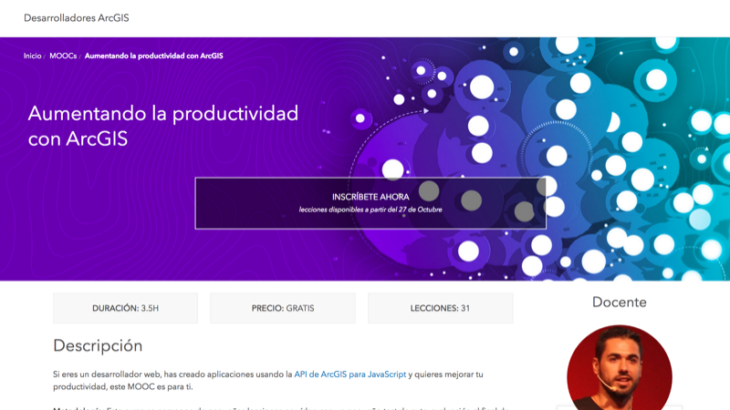](http://desarrolladores.esri.es/upcoming/moocs/plataforma-arcgis/)

`In progress:` 20-30 vídeos [5-10]min ~5h

--

### Otras ideas

|Ideas|Cons|Pros|
|---|---|---|
|**Youtube PlayLists** ([sample](https://www.youtube.com/watch?v=OFltRdXsOEs&list=PLwq5dz_FjCx4xknDRCNqNR_mRIfMRLkXa)): Proxy, OAuth, Web Maps, API REST, ...|?¿|Como: [AngularJS](https://www.youtube.com/user/angularjs/playlists), [CodeAcademy](https://www.youtube.com/user/learncodeacademy/playlists), etc.
|**Trozear vídeos** de [videos.esri.com](http://www.esri.com/videos) y luego indexarlos|Inglés| Partimos de cientos de vídeos (163 DevSummit)
|**Píldoras mensuales** (2/3 vídeos de 5min)|Superficiales|Fácil de seguir|

---

<!-- .slide: class="section" -->

### Novedades

\- 4 iniciativas -

--

### [Developer Summit](https://github.com/esri-es/devsummits-esri-spain/) (Evento anual)

[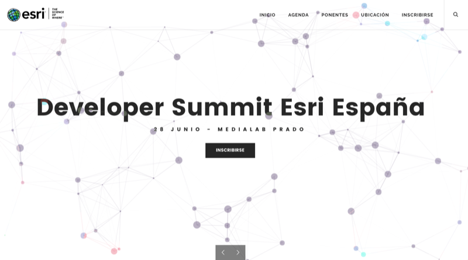](http://desarrolladores.esri.es)

--

### [Track Developers Confe](http://conferencia.esri.es) (Evento anual)

[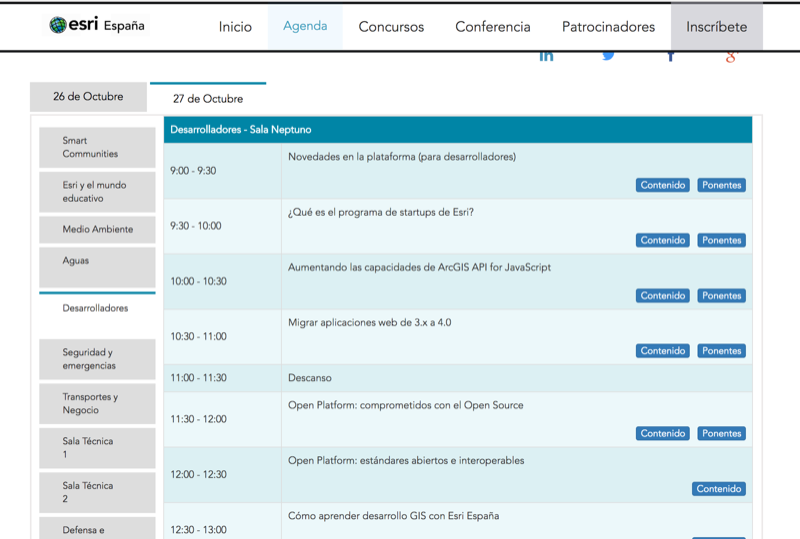](http://conferencia.esri.es)

--

### [Desarrolladores.esri.es](http://desarrolladores.esri.es) (Blog)

[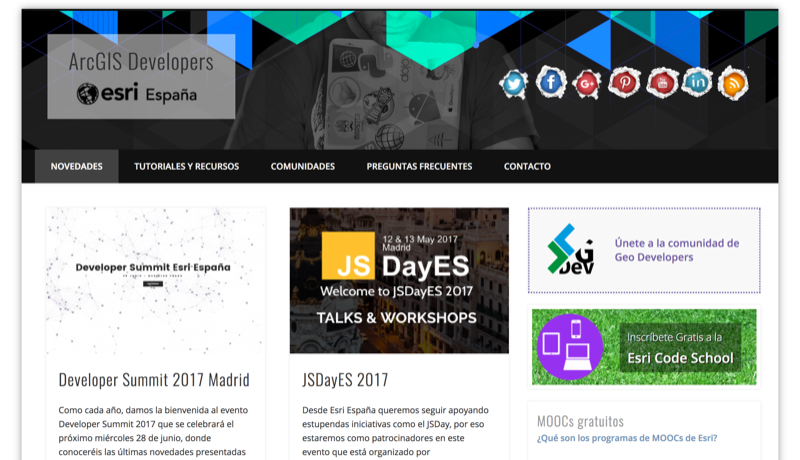](http://desarrolladores.esri.es)

61 artículos

--

### [Esri Code School](http://desarrolladores.esri.es/code-school/) (Newsletter)

[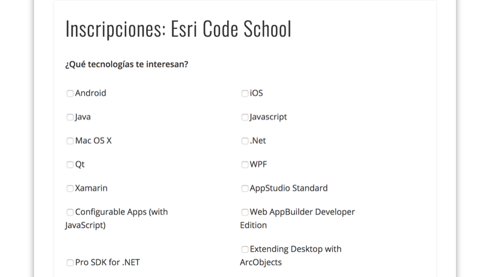](http://desarrolladores.esri.es/code-school/)

Newsletter segmentada ("mensual")

--

### Idea: 

* Cuenta de Twitter

  * **Cons**: Ya hay muchas -> @EsriDevSummit, @ArcPy, 
  @EsriGeoDev, @EsriStartups, @EsriMooc, etc.

  * **Pros**: Unificar e incluir contenidos de Esri España

* Podcast
  
  * **Cons**: No se puede enseñar código

  * **Pro**: es fácil de encontrar ratos muertos para escucharlos

---

<!-- .slide: class="section" -->

### Comunidad

\- 3 iniciativas -

--

### [Meetup Geo-Developers](https://www.meetup.com/es-ES/Geo-Developers/messages/archive/) (Lista de correo)

[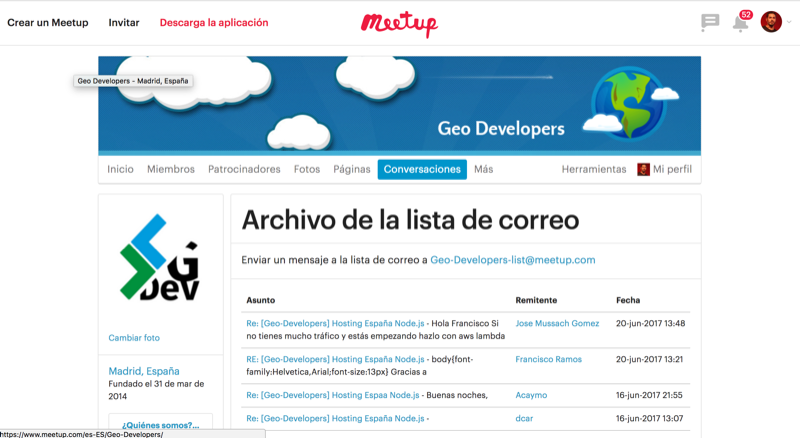](https://www.meetup.com/es-ES/Geo-Developers/messages/archive/)

~ 1150 Geo Developers

--

### [GeoDev.Slack.com](https://geodev.slack.com) (Mensajería instantánea)

[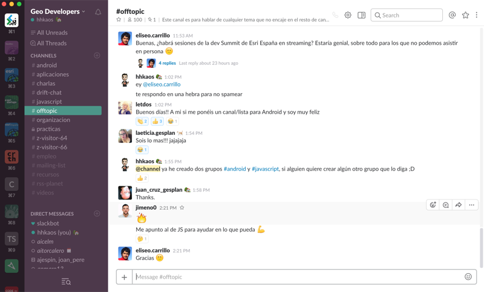](https://geodev.slack.com)

~ 100 miembros

--

### [GeoNet GeoDev-Spain](https://geonet.esri.com/groups/geodev-spain) (Foro)

[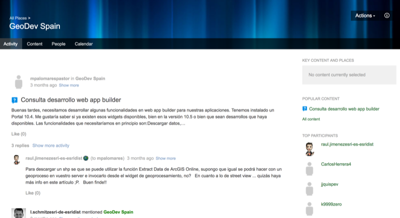](https://geonet.esri.com/groups/geodev-spain)

`En fase de pruebas`

--

### Ideas

|Ideas|Cons|Pros|
|---|---|---|
|Lista correo (exclusiva ArcGIS dev)|Intrusiva &  ¿duplicidad?|Rápida  adaptación
|Stackoverflow|Inglés|Recorrido

---

<!-- .slide: class="section centered" -->

## ¿Preguntas?

Raúl Jiménez Ortega: raul.jimenez@esri.es

Feeback: [bit.ly/DevSummit17-FB](http://bit.ly/DevSummit17-FB)

Transparencias: [bit.ly/DevSummit17-1](http://bit.ly/DevSummit17-1)

---

<!-- .slide: class="end" -->
#
