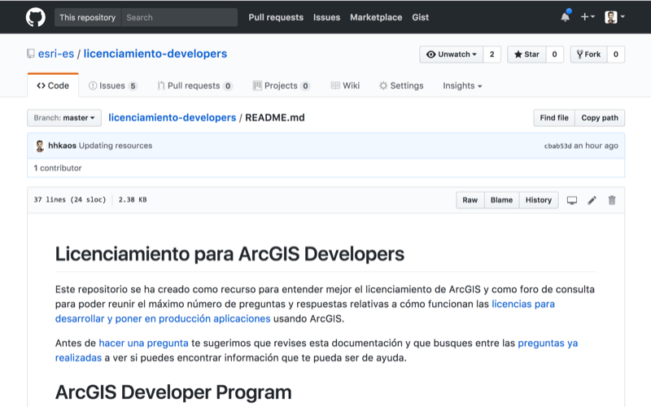

<!-- .slide: class="title" -->

## Licenciamiento para desarrolladores

Raúl Jiménez Ortega ([@hhkaos](//twitter.com/hhkaos))

[bit.ly/DevSummit17-X](#)

---

<!-- .slide: class="agenda" -->

### Agenda

* Repo: Licenciamiento para developers
* Licencias para desarrollar
* Licencias para poner en producción

---

<!-- .slide: class="section" -->

### Repo: Licenciamiento para developers

---

<!-- .slide: class="section" -->

### Licencias para desarrollar

\- 5 planes (paquetes de licencias) -

--

#### Plan: Essentials

--

#### Plan: Builder

--

#### Plan: Professional

--

#### Plan: Premium

--

#### Plan: Enterprise

---

<!-- .slide: class="section" -->

### Licencias para poner en producción

--

#### Apps que usan ArcGIS Online

--

#### Cuándo se requieren usuarios nominales

--

#### Licenciar apps creadas usando una Runtime

Niveles: 
* Lite
* Basic
* Standard
* Advanced

Extensión de análisis

---

### FAQ

--

# A qué equivale mi EDN?

---

<!-- .slide: class="section centered" -->

## Questions?

* Author 1: email
* Author 2: email

Slides: [bit.ly/xxxxxx](http://bit.ly/xxxxxx)

---

<!-- .slide: class="end" -->
#
