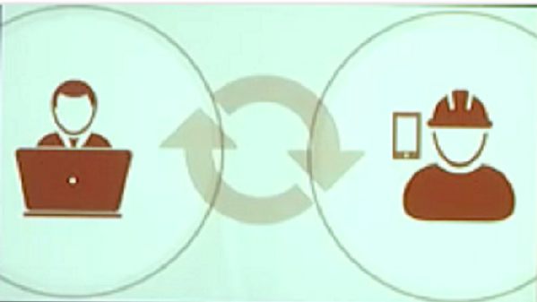

<!-- .slide: class="title" -->

## Utilizando Arcade en las plataformas ArcGIS

#### Mapping 2D

Slides : [https://github.com/Geo-Developers/talks/tree/master/slides](https://goo.gl/BzIZ9k)

--

<!-- .slide: class="section" -->

## Objetivos

- Conocer Arcade
  - ¿Qué es Arcade?
 - ¿Para qué se utiliza?

- Arcade como Lenguaje
  - Variables, Funciones, Bucles, Condiciones

- Arcade y la plataforma ArcGIS

--

<!-- .slide: class="section" -->

## ¿Qué es Arcade?

- Un nuevo lenguaje de expresión para las plataformas ArcGIS
 - ArcGIS Pro
 - Runtime SDKs
 - JavaScript API
 - Web Apps

- Principalmente diseñado para los web maps y web scenes de ArcGIS Online

--

<!-- .slide: class="section" -->

## ¿Para qué sirve Arcade?

- Arcade NO se creó para ser un Full Programming / Scripting Language
 - Objetivo: Lenguaje ligero y sencillo
 - Equivalente a una operación matemática realizada en una hoja de cálculo

- Creación de expresiones
 - Etiquetado, Representación visual, Variación de símbolos...
 - Fácil de compartir

--

<!-- .slide: class="section" -->

## ¿Para qué sirve Arcade?  

- **NO reemplaza a Python como lenguaje para la realización de Geoprocesos y Automatización**

--

<!-- .slide: class="section" -->

## Arcade como Lenguaje

### Variables, Funciones, Bucles, Condicionales...

--

<!-- .slide: class="section" -->

## ¿Cómo funciona Arcade?

### Demo

--

<!-- .slide: class="section" -->

## Resources

* **Documentación de Arcade:**

  

--

<!-- .slide: class="section" -->

## Resources

* **Awesome List:**

  

---

<!-- .slide: class="section" -->

## Da vida a tus datos en la plataforma ArcGIS: Vector Tiles

#### Mapping 2D

--

<!-- .slide: class="section" -->

## Objetivos

- ¿Por qué utilizar los Vector Tiles?
- Vector Tiles y la plataforma ArcGIS
- Uso de los Vector Tile en las aplicaciones
- Creacion de un Vector Tile

--

<!-- .slide: class="section" -->

## ¿Por qué utilizar los Vector Tiles?

--

<!-- .slide: class="section" -->

## Ventajas de los Vector Tiles

* Calidad de Visualización
 - La mejor resolución posible para pantallas de tipo Retina
 - Formato pequeño y eficiente
* Etiquetado dinámico
 - Mayor claridad, texto más legibles
 - Etiquetado al vuelo para pantallas heads-up (HUD)
* Estilo de mapa
 - Streets, Topo, Canvas desde un tileset (paquete de teselas)
 - Modo Día y Noche
 - Remodelación

--

<!-- .slide: class="section" -->

## Vector Tiles | Basemaps y la plataforma ArcGIS

* [**Repositorio Git ESRI España**](https://github.com/esri-es/arcgis-vector-tiles)

--

<!-- .slide: class="section" -->

## Uso de los Vector Tiles en aplicaciones

* Multiples formas de utilizar los Vector Tile:
 - Utiliza los vector tiles que proporciona ESRI
 - Personaliza el estilo de los vector tiles según el uso que quieras darle:
   - Cambia los colores
   - Incluye Capas
   - Satisface las necesidades de tu aplicación
 - Crea tu propio Vector Tile a partir de tus propios datos

--

<!-- .slide: class="section" -->

## ¿Cómo se crean los Vector Tiles?

* Creación de las teselas en ArcGIS Pro 1.2+
* Publicar las tile layers (capas de teselas) en ArcGIS Online y ArcGIS Server/Portal 10.4+
* En ArcGis Pro 1.4
  - Permite publicar los vector tiles como Web Layer
  - Crear, editar, y publicar en un solo paso
* Herramientas relacionadas:
  - [Crear índice de teselas vectoriales](http://pro.arcgis.com/es/pro-app/tool-reference/data-management/create-vector-tile-index.htm)
  - [Crear paquete de teselas vectoriales](http://pro.arcgis.com/es/pro-app/tool-reference/data-management/create-vector-tile-package.htm)

--

<!-- .slide: class="section" -->

## ¿Cómo se crean los Vector Tiles?

* Demo

--

<!-- .slide: class="section" -->

## ¿Cómo se crean los Vector Tiles?

* ArcGIS Pro

--

<!-- .slide: class="section" -->

## ¿Cómo se crean los Vector Tiles?

* Vector Tile publicado en ArcGIS Online

--

<!-- .slide: class="section" -->

## Resources

* **Awesome List:**

  

---

<!-- .slide: class="section" -->

## Technology Trends

--

<!-- .slide: class="section" -->

## Aportando soluciones con la plataforma ArcGIS

* [Global Forest Watch Fires](http://www.arcgis.com/home/item.html?id=06ec4d531a8b4b5da870aab6c4adb926)

--

<!-- .slide: class="section" -->

## Lifecycle of Technology

--

<!-- .slide: class="section" -->

## Technology Spectrum

--

<!-- .slide: class="section" -->

## Prototype:
### Passive Sensing

Portland, Maine (EEUU)

--

<!-- .slide: class="section" -->

## Prototype:

Melbourne, Australia

--

<!-- .slide: class="section" -->

--

<!-- .slide: class="section" -->

## Prototype:

Washington D. C., EEUU

--

<!-- .slide: class="section" -->

## Prototype:

Washington D. C., EEUU

--

<!-- .slide: class="section" -->

## Demo:

Sonar

* Git Repository: [Sonar Repo](https://github.com/Esri/sonar)

--

<!-- .slide: class="section" -->

## Demo:

Kuwait Finder App

---

<!-- .slide: class="end" -->
