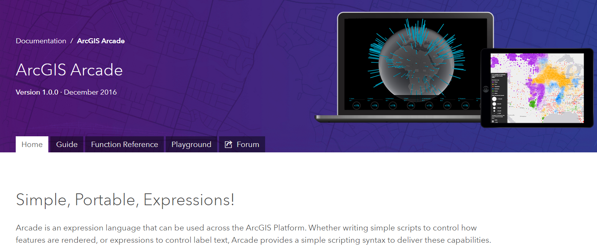
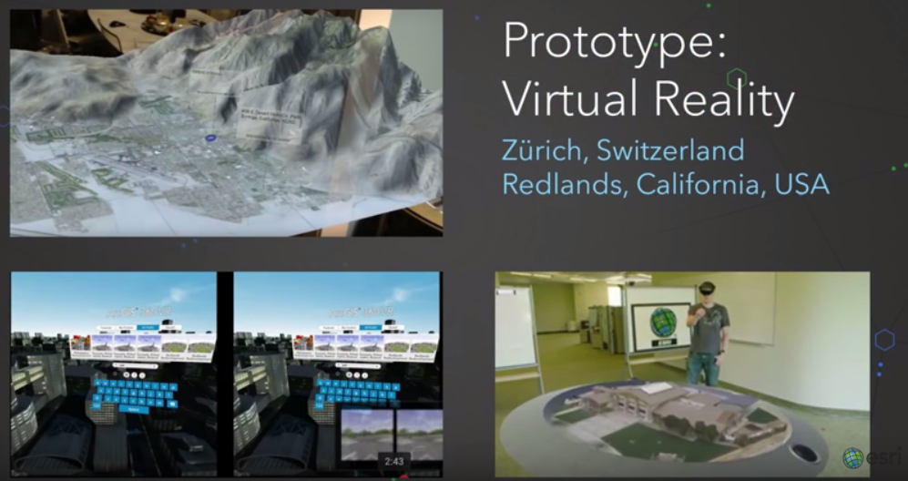
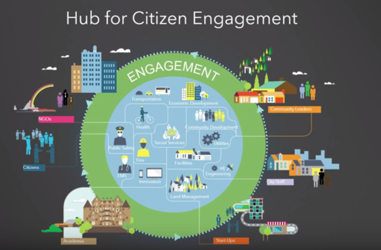
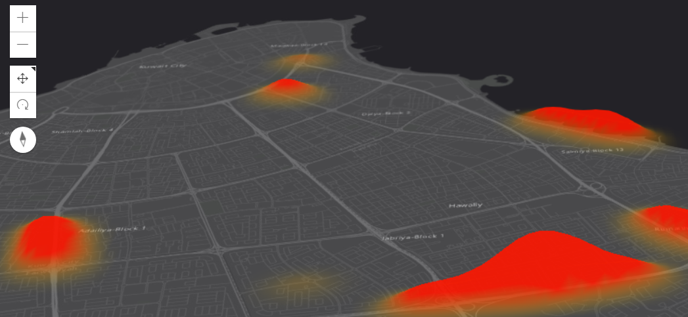

<!-- .slide: class="title" -->

#### Andrea Martín Rodríguez

* Slides: [Acceder aquí](https://anmaro13.github.io/devsummits-esri-spain/2017/ppts/sesion-inaugural-andrea/#/)

---

## Utilizando Arcade en las plataformas ArcGIS

#### Mapping 2D

--

<!-- .slide: class="section" -->

## ¿Cómo funciona Arcade?

### Demo

--

<!-- .slide: class="section" -->

## Resources

* **Documentación de Arcade:**

  

--

<!-- .slide: class="section" -->

## Resources

* **Awesome List:**

  

---

<!-- .slide: class="section" -->

## Da vida a tus datos en la plataforma ArcGIS: Vector Tiles

#### Mapping 2D

--

<!-- .slide: class="section" -->

## Vector Tiles | Basemaps y la plataforma ArcGIS

* [**Repositorio Git ESRI España**](https://github.com/esri-es/arcgis-vector-tiles)

--

<!-- .slide: class="section" -->

## ¿Cómo se crean los Vector Tiles?

* Demo

--

<!-- .slide: class="section" -->

## ¿Cómo se crean los Vector Tiles?

* Vector Tile publicado en ArcGIS Online

--

<!-- .slide: class="section" -->

## Resources

* **Awesome List:**

  

---

<!-- .slide: class="section" -->

## Technology Trends

--

<!-- .slide: class="section" -->

## Aportando soluciones con la plataforma ArcGIS

* [Global Forest Watch Fires](http://www.arcgis.com/home/item.html?id=06ec4d531a8b4b5da870aab6c4adb926)

--

<!-- .slide: class="section" -->

## Lifecycle of Technology

--

<!-- .slide: class="section" -->

## Prototype:

Melbourne, Australia

--

<!-- .slide: class="section" -->

## Prototype:

* Repositorio Git ESRI: [AuGeo - Augmented Reality for ArcGIS](https://github.com/Esri/AuGeo)

--

<!-- .slide: class="section" -->

--

<!-- .slide: class="section" -->

## Prototype:

Washington D. C., EEUU

--

<!-- .slide: class="section" -->

## Demo:

Sonar

* Git Repository: [sonar Repo](https://github.com/Esri/sonar)

--

<!-- .slide: class="section" -->

## Demo:

Kuwait Finder App

* Git Repository: [space-time-ripple](https://github.com/mraad/space-time-ripple)

---

<!-- .slide: class="end" -->
