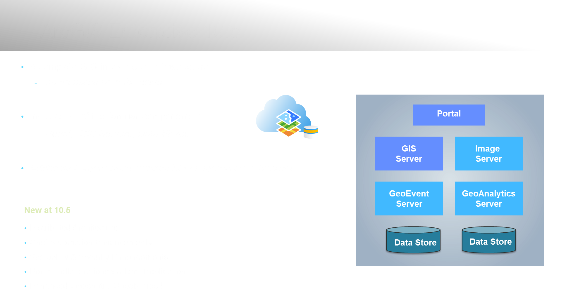

 <!-- .slide: class="title" -->

## Resumen de Novedades

---

<!-- .slide: class="section" -->

---

---

---

---

---

<!-- .slide: class="section" -->

### ArcGIS Enterprise | Componentes

---

### ArcGIS Enterprise | Server Roles

---

|ArcGIS Online| ArcGIS Enterprise|
|:---:|:---:|
|SaaS| Instalación de Software|
|Alojado en servidores de ESRI| En tu propia infraestructura tanto en la nube como en local|
|Actualizaciones automáticas (ESRI)|Actualizaciones manuales|
|Contenido Web| Servidores GIS específicos|

Funcionalidades **Core Web GIS**:

- Visualización: Basemaps, vector tiles...
- Contenido: Linving Atlas...
- Análisis: GeoEnriquecimiento, Rutas...

---

---

---

---

---

---

---

---

<!-- .slide: class="end" -->

---

<!-- .slide: class="title" -->

## Automating and Scripting the Platform
 Leticia Matas ([@aicel_m](//twitter.com/aicel_m))

---

<!-- .slide: class="part" -->

---

<!-- .slide: class="section center" -->

## Chef

### [Cookbooks for ArcGIS](https://github.com/Esri/arcgis-cookbook)

---

## Ejemplo Chef

<iframe width="700" height="530" src="https://www.youtube.com/embed/hQzNeJBtWHQ?t=3m23s" frameborder="0" allowfullscreen></iframe>

---

