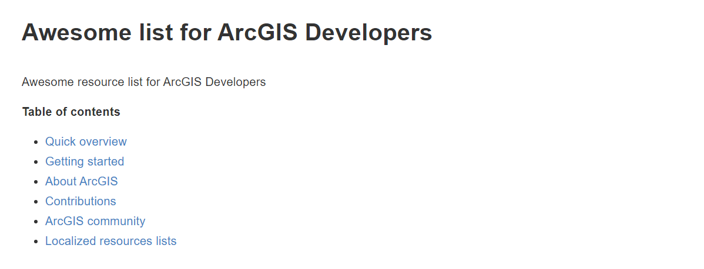

<!-- .slide: class="title" -->

## Sesión inaugural

* Leticia Matas ([@aicel_m](//twitter.com/aicel_m))
* Andrea Martín
* Raúl Jiménez ([@hhkaos](//twitter.com/hhkaos))
* Marta Dávila ([@marta_davila](//twitter.com/marta_davila))

[bit.ly/DevSummit17-2](http://bit.ly/DevSummit17-2)

---

<!-- .slide: class="section" -->

-

--

--

--

--

### ArcGIS Enterprise | Componentes

>|||
|:--|:--|
|ArcGIS Server| Motor|
|Portal for ArcGIS| Interfaz|
|ArcGIS Data Store| Almacén de datos|
|ArcGIS Web Adaptor| Seguridad|

--

### ArcGIS Enterprise | Server Roles

- GIS Server
- Image Server
- GeoEvent Server
- GeoAnalytics Server
- Business Analyst Server

--

>|ArcGIS Online| ArcGIS Enterprise|
|:---|:---|
|SaaS| Instalación de Software|
|Alojado en servidores en la nube| En tu propia infraestructura|
|Actualizaciones automáticas (ESRI)|Actualizaciones manuales|
|Contenido Web| Servidores GIS específicos|

Funcionalidades _Core Web GIS_

(Visualización, Contenido, Análisis)

--

--

--

--

--

--

--

--

---

## Utilizando Arcade en las plataformas ArcGIS

#### Mapping 2D

--

<!-- .slide: class="section" -->

## ¿Cómo funciona Arcade?

### Demo

--

<!-- .slide: class="section" -->

## Resources

* **Documentación de Arcade:**

  

---

<!-- .slide: class="section" -->

## Da vida a tus datos en la plataforma ArcGIS: Vector Tiles

#### Mapping 2D

--

<!-- .slide: class="section" -->

## Vector Tiles | Basemaps y la plataforma ArcGIS

* [**Repositorio Git ESRI España**](https://github.com/esri-es/arcgis-vector-tiles)

--

<!-- .slide: class="section" -->

## ¿Cómo se crean los Vector Tiles?

* Demo

--

<!-- .slide: class="section" -->

## ¿Cómo se crean los Vector Tiles?

* Vector Tile publicado en ArcGIS Online

--

<!-- .slide: class="section" -->

## Resources

* **Awesome List:**

  

---

<!-- .slide: class="section" -->

### ArcGIS API for JavaScript 4.x

Novedades

--

<!-- .slide: class="section" -->

#### Mejoras en rendimiento

* [CDN + HTTP2](http://www.arcgis.com/home/webmap/viewer.html?webmap=019e2850894746fe9dafd929402a4a1a)

* [Nuevo renderizador que usa la GPU](https://youtu.be/gHhV44rdPBA?t=12m56s) (Q4 - 2017)

--

<!-- .slide: class="section" -->

## 3D Simbología & layer views - [Link](https://youtu.be/gHhV44rdPBA?t=4m44s) 04:44-06:45

--

<!-- .slide: class="section" -->

## Editar feature layers

<!--10-37-12:40-->

<iframe src="demos/editing-applyedits.html" style="width:100%; height:600px"></iframe>

--

<!-- .slide: class="section" -->

## FeatureLayer "mode"

<iframe src="demos/layers-featurelayer-improvements.html" style="width:100%; height:600px"></iframe>

--

### Widgets (3 nuevos)

<iframe src="demos/4x-widgets.html" style="width:100%; height:600px"></iframe>

--

## 3D: Scene layers, Styles & Vector tiles

* [ArcGIS Online: Publish Scene Layer (Beta)](http://hhkaos2.maps.arcgis.com/home/item.html?id=89366e15cded47348ccdc35accde92b8)
* Vector tiles, [3D Web Styles](https://developers.arcgis.com/javascript/latest/guide/esri-web-style-symbols/index.html) - [Demo](http://hhkaos2.maps.arcgis.com/home/webscene/viewer.html?webscene=bf1d0156125847a8982ca5a90bc52c84)
* [Web Scene Spec](https://developers.arcgis.com/web-scene-specification/)

 <!-- 01:35-3:10 (1.5min)-->

--

## Novedades en 3D

  * [Modificar y guardar items](demos/webscene.html)
  * [Filtrar y consultar objetos 3D ](https://esri.github.io/c-through/?demo)
  * [Capas de nubes de puntos](demos/pcl.html)
  * [Renderizador 3D externo](demos/3d-external-renderer-wind-global/index.html)

--

<!-- .slide: class="section" -->

## Recursos (en inglés)

* [What's new on JS (2D)](https://youtu.be/gHhV44rdPBA?t=10m38s)
* [What's new on JS (3D)](https://youtu.be/8ebDGwBZTUI?t=1m35s)
* [Symbology & layer views](https://youtu.be/gHhV44rdPBA?t=4m44s)
* [New rendering using the GPU](https://youtu.be/gHhV44rdPBA?t=12m56s)
* [CDN + HTTP2](https://youtu.be/gHhV44rdPBA?t=3m01s)

---

<!-- .slide: class="section" -->

## Runtime SDKs

---

<!-- .slide: class="section" -->

## ArcGIS Pro SDK

---

<!-- .slide: class="section" -->

## ArcGIS Enterprise

---

<!-- .slide: class="title" -->

## Automating and Scripting the Platform

--

<!-- .slide: class="section centered" -->

# Chef

--

<!-- .slide: class="section" -->

### 

--

<!-- .slide: class="section" -->

## Demo

--

<!-- .slide: class="section centered" -->

# Python

--

<!-- .slide: class="section centered" -->

--

<!-- .slide: class="section" -->

--

<!-- .slide: class="section" -->

---

<!-- .slide: class="section" -->

## Technology Trends

--

<!-- .slide: class="section" -->

## Aportando soluciones con la plataforma ArcGIS

* [Global Forest Watch Fires](http://www.arcgis.com/home/item.html?id=06ec4d531a8b4b5da870aab6c4adb926)

--

<!-- .slide: class="section" -->

## Lifecycle of Technology

--

<!-- .slide: class="section" -->

## Prototype:

Melbourne, Australia

--

<!-- .slide: class="section" -->

## Prototype:

* Repositorio Git ESRI: [AuGeo - Augmented Reality for ArcGIS](https://github.com/Esri/AuGeo)

--

<!-- .slide: class="section" -->

--

<!-- .slide: class="section" -->

## Prototype:

Washington D. C., EEUU

--

<!-- .slide: class="section" -->

## Demo:

Sonar

* Git Repository: [sonar Repo](https://github.com/Esri/sonar)

--

<!-- .slide: class="section" -->

## Demo:

Kuwait Finder App

* Git Repository: [space-time-ripple](https://github.com/mraad/space-time-ripple)

---

<!-- .slide: class="section" -->

Feeback: [bit.ly/DevSummit17-FB](http://bit.ly/DevSummit17-FB)

---

<!-- .slide: class="end" -->